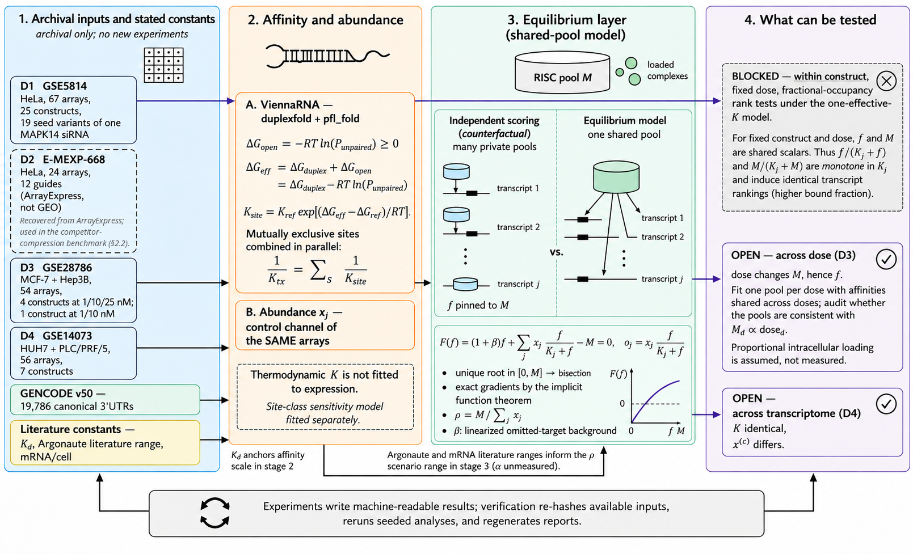
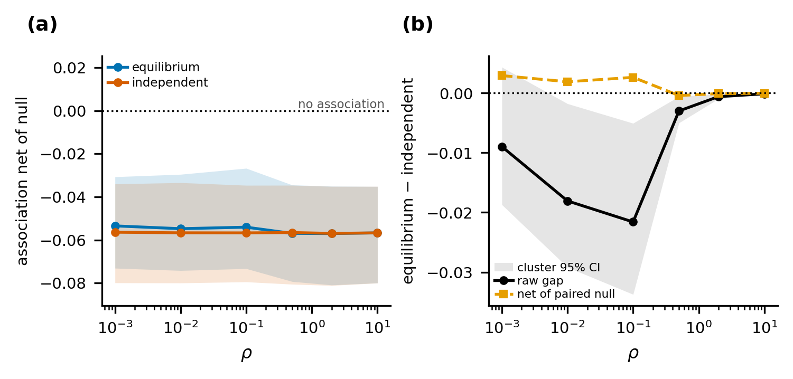
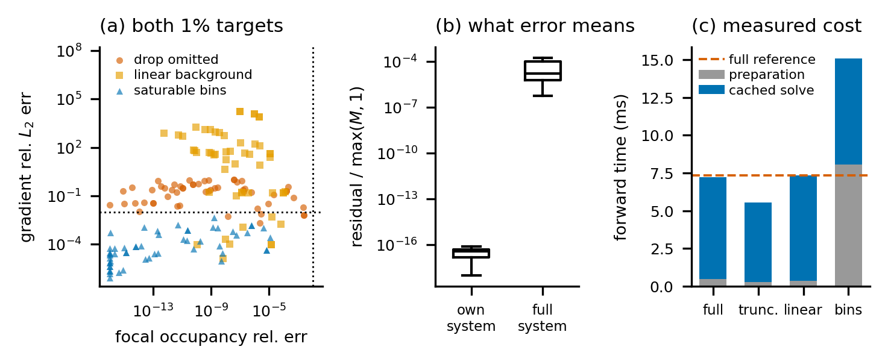
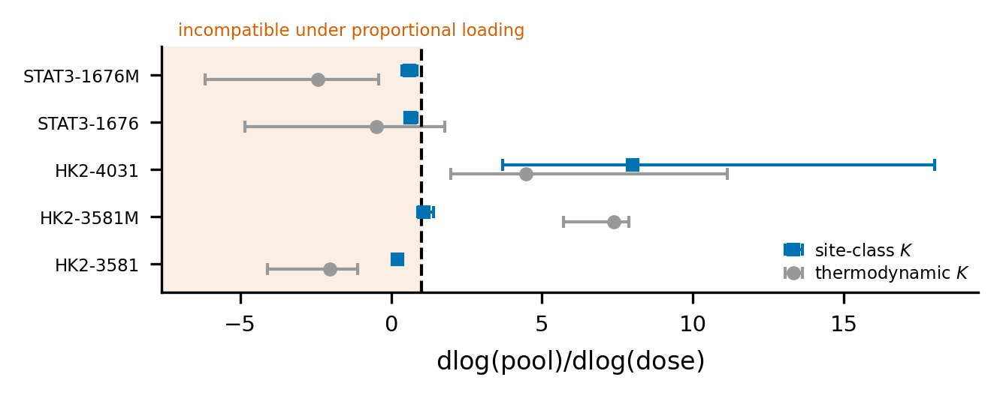

# One pool, many targets

**A conservation layer and what archival data can identify.**

Code, experiments, saved results and figures for GEM bio workshop submission 101.
A differentiable equilibrium layer accounts for competition among transcripts
for a finite pool of guide-loaded RISC. The study develops the operator and audits
what archival off-target expression data can tell us about its predictive value.

[Figure and experiment map](FIGURE_MAP.md) · [Reproduction guide](GUIDE.md) · [Source code](src/riscpool/) · [Saved results](results/)

## Workflow



Control-channel expression and GENCODE v50 transcript sequences provide the
abundances and candidate sites. ViennaRNA supplies thermodynamic features. The
conservation layer converts these inputs into coupled occupancies, which are
evaluated against measured repression, dose series and changes in transcriptome.

For a loaded pool $M$, transcript abundance $x_j$, effective affinity parameter
$K_j$, and a linear background reservoir $\beta$, the free pool $f$ solves

$$
(1+\beta)f + \sum_j \frac{x_j f}{K_j+f} = M,
\qquad o_j = \frac{x_j f}{K_j+f}.
$$

The scalar equation has a unique root bracketed by $[0,M]$ and exact implicit
gradients. This workshop release uses the original bisection implementation.
Within one construct at one dose, fractional occupancy is monotone in $K_j$ under
both equilibrium and independent scoring, so transcript ranks cannot distinguish
them. The experiments therefore examine pooled constructs, dose and context.

## Results

| Experiment | Recorded result | What it supports |
|---|---|---|
| Off-target association, GSE5814 | 24 constructs and 34,676 construct–transcript pairs; at $\rho=0.1$, pooled Spearman is −0.0746 for equilibrium and −0.0530 for independent scoring | Weak associations with repression; the paired-null analysis does not establish added predictive value from coupling |
| Competitor compression | 100 retained transcripts and 100 saturable bins meet both 1% error targets on all 54 held-out cases from 7 guide families | Accurate occupancy and gradients; no measured speed-up at the tested size |
| Dose-series audit, GSE28786 | Site-class pooled exponent 1.424, bootstrap 95% interval [0.956, 2.518]; excluding HK2-4031 changes it to 0.633 | Heterogeneous fits do not identify a stable competition parameter |
| Solver checks | Seed benchmark conservation residual $4.263\times10^{-14}$; worst implicit-gradient relative error $1.074\times10^{-7}$ | Numerical validation of the original layer |

### Does coupling improve prediction?



At $\rho=0.1$, the raw correlation gap is −0.0216, while the paired permutation
null already has a mean gap of −0.0242. The remaining +0.00265 does not support an
improvement from coupling. Repression is negative, so a more negative association
is the working direction. The analysis uses 1,000 within-construct permutations
and 2,000 construct-cluster bootstrap resamples.

Source: [off-target ranking](results/e7_offtarget_ranking.json) and
[paired-null and cluster-bootstrap results](results/e7b_null_calibration.json).

### How accurately can the competitor set be compressed?



Saturable bins reach a worst focal-occupancy relative error of $1.16\times10^{-5}$
and worst gradient relative error of 0.00466, both below the 0.01 targets.
End-to-end forward time is **15.3 ms**, compared with **7.3 ms** for the full
reference: one construct with 4,919 competitors, single-threaded CPU, float64.
The approximation is accurate, but it is not faster on this workload.

Source: [frozen selection and held-out results](results/positive_extensions/B_selected_and_heldout.json),
[compression audit](results/pxb_audit.json), and [experiment code](scripts/run_pxb_approx.py).

### What does the dose series identify?



Fits vary substantially across the five constructs and between affinity models.
Under proportional loading, the model-implied exponent cannot fall below one;
the observed violations challenge that combined specification. The pooled
estimate is sensitive to a single construct, so these data do not provide a
calibrated cellular estimate of the competition parameter.

Source: [dose-response results](results/e9_dose_response.json) and
[cross-context audit](results/e10_cross_context.json).

The [complete figure map](FIGURE_MAP.md) covers all 11 numbered submission
figures, both tables, the supplementary simulations and the negative external
affinity-correction experiment. All saved findings are retained.

## Data

| Dataset | Role | Repository identifier |
|---|---|---|
| GSE5814 — Jackson et al. | Off-target repression in HeLa | D1 |
| E-MEXP-668 — Birmingham et al. | External guide families and compression evaluation | D2 |
| GSE28786 — Caffrey et al. | Dose-series audit | D7; submission D3 |
| GSE14073 — Burchard et al. | Cross-context audit | D8; submission D4 |

[Data provenance](data/PROVENANCE.json) records acquisition URLs and hashes.
Raw downloads, derived caches and third-party literature are fetched or rebuilt
by the acquisition scripts. The saved result files are enough to redraw the plots.

## Reproduce

Check the archived files without installing scientific packages:

```bash
git clone https://github.com/shadi97kh/One-Pool-Many-Targets.git
cd One-Pool-Many-Targets
python3 verify_snapshot.py
```

With Python 3.13, install the recorded dependencies, run the original solver
checks and regenerate the figures:

```bash
python3 -m pip install -r requirements-workshop.txt
PYTHONPATH=src OMP_NUM_THREADS=1 MKL_NUM_THREADS=1 OPENBLAS_NUM_THREADS=1 python3 -m riscpool.checks
python3 scripts/make_figures.py
python3 scripts/make_px_figures.py
```

The [reproduction guide](GUIDE.md) lists the full acquisition and experiment
sequence, including the compression and external-affinity extensions.
Regeneration writes outputs; use a separate working copy to preserve the archive.

## Repository layout

```text
src/riscpool/          equilibrium layer, gradients, data and feature code
scripts/               acquisition, experiment and plotting entry points
results/               saved experiment records and extension tables
figures/               workflow, result plots and captions
data/                  source ledger and literature constants
provenance/            original workshop README and ignore rules
FIGURE_MAP.md          submission figures and tables mapped to their sources
GUIDE.md               reproduction instructions and scope
verify_snapshot.py     checksum and figure-reference verification
```

The scientific files are preserved from GEM commit
[`bd7850d`](https://github.com/shadi97kh/RISCPOOL_GEM/commit/bd7850d3cac09b9564ea4b394fbdad111d399f3e)
(September 7, 2026). AISTATS experiments and later solver changes remain in the
[GEM repository](https://github.com/shadi97kh/RISCPOOL_GEM).
[Validation](VALIDATION.json) records the original solver checks and byte-identical
regeneration of all 12 numerical plot images. Full historical experiment runs
were not repeated when preparing this release.
