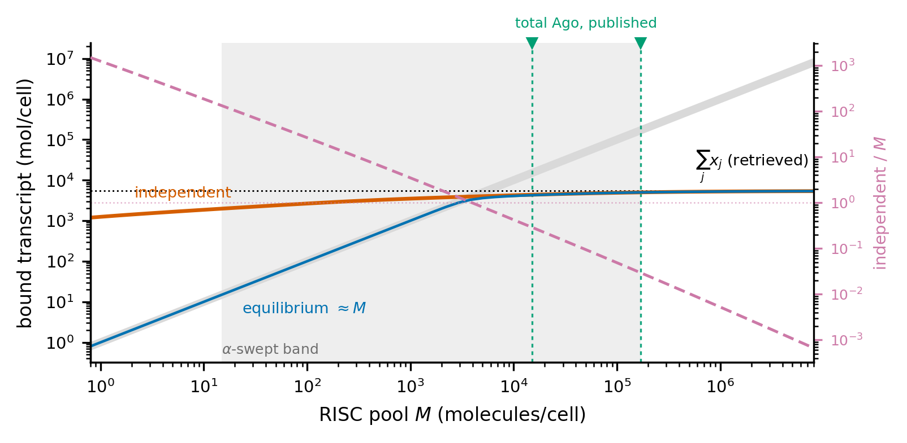
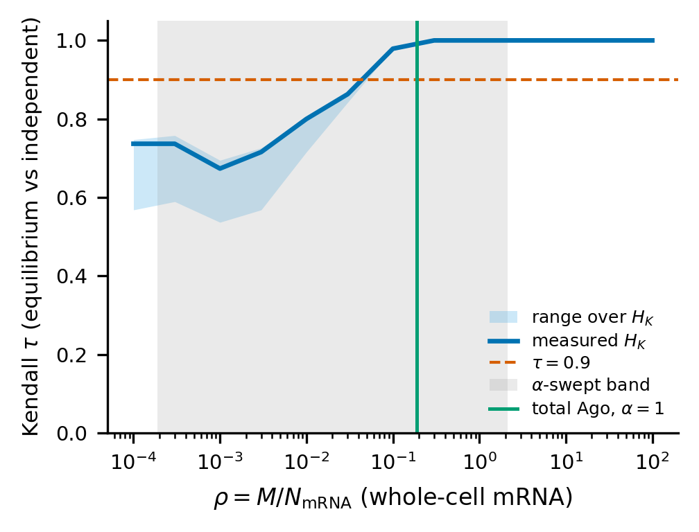
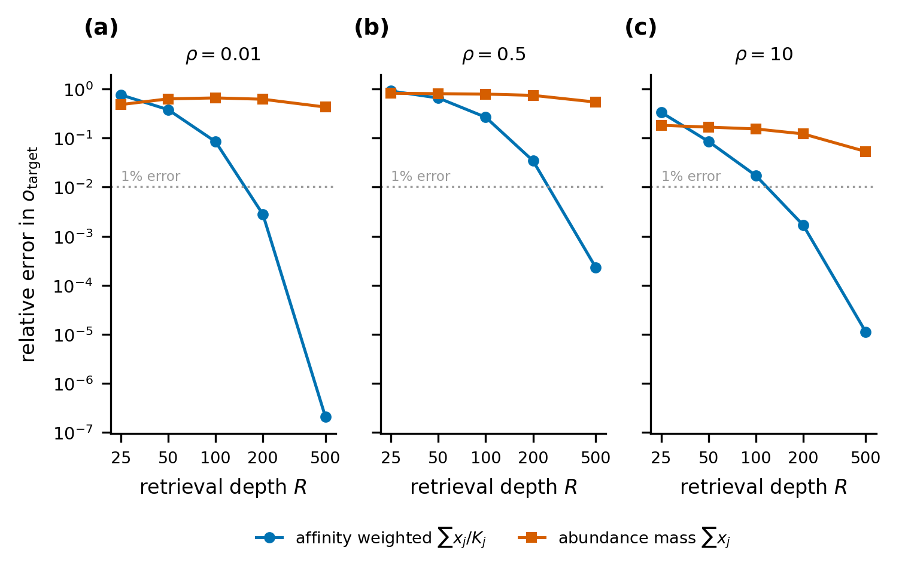

# riscpool

A differentiable shared-resource equilibrium layer for RISC occupancy, built and
tested against measured data rather than simulation.

Transfected siRNAs compete for a finite pool of loaded Argonaute. Predictors that
score each transcript independently ignore that competition, and can allocate
more RISC than the cell contains. This repository asks whether accounting for the
shared pool changes anything you would actually do, and answers it on real data:
the Jackson et al. 2006 off-target microarrays, the GENCODE v50 human
transcriptome, ViennaRNA thermodynamics, and published Argonaute copy numbers.

This repository holds the experiments and their outputs, not a write-up. Each
experiment writes one JSON file under `results/`, and the report and figures are
generated from those files.

**Build status:** 31 experiments recorded, none FAILED. 3315 s total recorded experiment compute. `verify.py` stages ABC last ran PASS: 0 failed of 159 checks, covering file integrity, recomputation of every seeded experiment from its seed, and report regeneration. The manifest also hashes the source, the experiment scripts, the verifier, the TeX sources, the figures and the compiled PDF, so a claim about which build produced which manuscript is checkable.

---

## Provenance and verification

The build is designed so that any reported quantity can be traced back to the
script and the input file that produced it, and so that the whole thing can be
re-run and checked.

| Mechanism | Where |
|---|---|
| Each experiment writes exactly one `results/<name>.json` with `status`, `values`, `seed`, `elapsed_s`, `traceback`. Nothing else reports numbers. | `src/riscpool/runner.py` |
| An exception is caught, printed loudly, written as `status: "FAILED"` with the full traceback, and the build continues. A plausible value is never substituted. | `src/riscpool/runner.py` |
| Every downloaded byte gets a ledger entry: exact URL, SHA256, size, UTC time, accession or release version. Failed URLs are recorded with their HTTP status. | `src/riscpool/provenance.py` → `data/PROVENANCE.json` |
| Git commit, UTC timestamp, Python version, full `pip freeze`, all seeds, per-experiment wall clock, SHA256 of every result file. | `scripts/make_manifest.py` → `MANIFEST.json` |
| Re-hashes every provenanced file, re-runs every seeded experiment, compares every numeric leaf against the recording, regenerates the report and diffs it. Exits nonzero on any mismatch. | `verify.py` |
| The report is generated from the JSONs. No table in it is written by hand. | `scripts/make_summary.py` → `results/SUMMARY.md` |

Simulated quantities are prefixed `sim_` in every filename, JSON key and caption,
and are kept separate from measured ones throughout.

---

## Headline results

Every row names the JSON file and key it was read from.

### The dataset and what had to be recovered from it

| Quantity | Value | Source |
|---|---|---|
| Distinct siRNA constructs in GSE5814 | 25 | `d1_gse5814` → `n_constructs` |
| MAPK14 seed-variant constructs | 19 | `d1_gse5814` → `n_mapk14_seed_variant_constructs` |
| GENCODE release | v50 | `d3_gencode` → `gencode_release` |
| Candidate genes, expressed and with a 3'UTR | 11,306 | `d4_hela_abundance` → `n_genes_joined_to_gencode_canonical_with_utr3` |
| Seed sites computed on real sequence | 50,708 | `f2_features` → `n_sites` |

The brief anticipated 27 constructs. The series as deposited contains 25, and the
measured count is what is reported.

**The siRNA sequences were never deposited.** GEO has none, and the publisher
returns 403/404 for the paper's full text and supplementary material. Five
failed URLs, all recorded. The guide strands were recovered from the Garcia et
al. 2011 supplementary table, which lists them per GEO array accession.

**They were then confirmed without using them.** `src/riscpool/seeds.py` recovers
each construct's 7mer-m8 site from the measured expression response alone, having
read no sequence file, by contrasting each construct against the constructs whose
mutation falls inside guide positions 2–8.

| Check | Result | Source |
|---|---|---|
| Recovered sites matching the published sequences | 19 of 20 | `d1_seed_validation` → `n_sites_exactly_agreeing` |
| Parent site, recovered from expression | `CTGCGGT` | `d1_seed_validation` → `parent_site_recovered_from_expression` |
| Parent site, published | `CTGCGGT` | `d1_seed_validation` → `parent_site_published` |
| Median rank of the parent site among 16,384 7-mers, seed-preserving constructs | 7 | `d1_seed_validation` → `median_rank_parent_site_seed_preserving_of_16384` |
| Same, seed-altering constructs | 14,770 | `d1_seed_validation` → `median_rank_parent_site_seed_altering_of_16384` |

Two independent routes to the same sequences is a stronger foundation than
either alone, and it validates the construct assignment parsed out of the GEO
free-text labels at the same time.

### e5: where a transfected cell might sit, and why that is not settled

| Quantity | Value | Source |
|---|---|---|
| ρ = M / Σx, HeLa band, low end | 1.875 × 10⁻⁴ | `e5_hela_regime` → `rho_hela_band_low` |
| ρ, HeLa band, high end | 2.125 | `e5_hela_regime` → `rho_hela_band_high` |
| τ = 0.9 contour, across the whole H_K grid | 0.0440 – 0.0499 | `e5_hela_regime` → `tau_0.9_contour_by_H_K` |
| Measured H_K, sd of log₁₀ K_on across the 20 candidates | 1.280 | `e5_hela_regime` → `H_K_measured_sd_log10_K_on` |
| Minimum Kendall τ inside the band | 0.705 | `e5_hela_regime` → `min_tau_anywhere_in_hela_band` |
| Equilibrium off-target load ÷ independent, at the band's low end | 0.00596 | `e5_hela_regime` → `hela_band_detail[0]` |

**A real transfected HeLa cell straddles the boundary.** The τ = 0.9 contour sits
at ρ ≈ 0.044–0.050 and is almost flat in H_K, while the literature-based
scenario range spans four decades across it, because the loaded fraction α is not
measured and is therefore swept rather than chosen. This is a scenario range, not
an estimated band: where the crossing falls depends on which Argonaute count you
accept, and neither figure is an AGO2-specific measurement.

| Argonaute source | ρ per unit α | α at which the layer stops reordering |
|---|---|---|
| Janas 2012, HeLa, ~15,000 total Ago1–4 | 0.1875 | 0.235 – 0.266 |
| Wang 2012, non-HeLa, ~170,000 total Ago1–3 | 2.125 | 0.021 – 0.023 |

On the HeLa-specific measurement, the layer changes candidate ranking for any
loaded fraction below roughly 0.27. At the low end of the scenario range
the independent counterfactual allocates 168× the equilibrium off-target
load, 2518 molecules bound against
15 from that pool. That low end is a
swept scenario, not a measured operating point.

The background term β is not measured either, so it is **bracketed** rather than
guessed: from zero (no non-seed binding at all) up to every non-retrieved
transcript binding at the published seed-mismatched K_d. Both ends are reported.

### e7: real off-target ranking

The result is partly an identity and partly a negative, and both are reported as
such.

**Within a single construct the two scorings cannot differ in rank.** Bound
fraction is `f/(K+f)` under equilibrium and `M/(K+M)` under independent
occupancy. `f` and `M` are scalars shared by every transcript, and both
expressions are strictly decreasing in `K`, so one is a strictly monotone
transform of the other and every rank statistic agrees exactly, at every ρ. This
is a property of the model, not a finding about this dataset. It is conditional:
it covers fractional occupancy under the one-effective-K, mutually-exclusive-site
formulation, and not absolute occupancy `x·q`, which reorders whenever abundance
differs. Measured residual:
1.7e-05, at the
level of the solver's bisection tolerance.

**Across constructs they do diverge**, because the free pool depends on the
construct's own competitor set while `M` does not.

| ρ | Kendall τ between the two scorings, pooled | Source |
|---|---|---|
| 0.001 | 0.527 | `e7_offtarget_ranking` → `pooled_across_constructs` |
| 0.1 | 0.771 | same |
| 2.0 | 0.996 | same |

**The positive control passes decisively**, which is what makes the negative
interpretable. Measured repression of transcripts carrying each seed site class,
against transcripts with no site, averaged over 24 constructs:

| Site class | Mean measured log₁₀(siRNA/mock) | Constructs with p < 0.05 |
|---|---|---|
| 6mer | −0.0115 | 23 / 24 |
| 7mer-m8 | −0.0219 | 22 / 24 |
| 7mer-A1 | −0.0313 | 22 / 24 |
| 8mer | −0.0528 | 22 / 23 |

All 24 constructs show significant repression of seed-matched transcripts, and
the canonical 8mer > 7mer > 6mer hierarchy is recovered from the data.

**Both scorings associate weakly with repression, and coupling is not shown to
add to it.** After the accessibility sign correction the pooled Spearman is
-0.0746 at ρ = 0.1 for equilibrium and
-0.0530 for independent scoring, both in the
working direction, since repression is negative. The difference between them is
not evidence that coupling helps: at ρ = 0.1, where they differ most,
the raw gap of -0.0216 sits against a paired
permutation null of -0.0242, leaving
+0.00265, which favours
independent scoring.
`EQUILIBRIUM_ADDS_ESTABLISHED_PREDICTIVE_VALUE` in `e7b_null_calibration` is
`False`. The weakness of the
association is a statement about the affinity model, not about the equilibrium
layer and not about whether seed matches are repressed. ViennaRNA's `duplexfold` cannot see the t1 = A contribution, which is
an Argonaute pocket effect rather than a base pair, and it reports the best duplex
anywhere in the scanned window rather than necessarily at the seed site. The JSON
says so in a dedicated `LIMITATION_thermodynamic_K` field. The predictors that do
carry signal, measured and reported, are local AU content (ρ = −0.166),
transcript abundance (−0.130) and site accessibility (−0.111).

### e4: retrieval invariance

| Quantity | Value | Source |
|---|---|---|
| Best affinity-rule relative error (R = 500, ρ = 0.01) | 5.3 × 10⁻¹⁰ | `e4_retrieval_invariance` → `table` |
| Worst abundance-rule relative error | 0.8186 (81.9 %) | `e4_retrieval_invariance` → `max_rel_err_o_target_abundance_rule` |
| Truncations where the linearisation assumption holds | 4 of 30 | `e4_retrieval_invariance` → `n_rows_where_linearisation_holds` |

The affinity-weighted background is exact to 10 significant figures at sufficient
depth, and the abundance-mass control is catastrophically wrong, as predicted.
But **the synthetic pilot's 0.04 % at R = 25 does not reproduce on the real
transcriptome**: the error there is 84–100 %. The diagnostic explains why: the
linear background replaces `X_bg f/(K_bg+f)` with `(X_bg/K_bg) f`, which needs
`K_bg ≫ f`, and ordering by `x/K` does not guarantee the omitted transcripts are
in the weak-binding tail. The fraction violating that assumption is measured at
every point plotted.

### e1, e2, e3: the layer itself, on real K

| Check | Result | Source |
|---|---|---|
| Seed-code conservation residual, reproduced exactly | 4.263256 × 10⁻¹⁴ | `e1_solver_correctness` → `seed_code_benchmark_conservation_residual` |
| Seed-code implicit-gradient error, reproduced exactly | 1.074152 × 10⁻⁷ | `e1_solver_correctness` → `seed_code_benchmark_gradient_worst_relative_error` |
| Conservation residual on real K | 9.1 × 10⁻¹³ | `e1_solver_correctness` → `max_abs_residual_F_of_f` |
| Gradient error relative to the gradient norm, real K | 2.30 × 10⁻⁷ | `e1_solver_correctness` → `worst_error_relative_to_gradient_norm` |
| `d o_i/d K_t > 0` violations (i ≠ t) | 0 of 1,200 | `e2_redistribution` → `claim_A_...` |
| `d o_t/d K_t < 0` violations | 0 of 1,200 | `e2_redistribution` → `claim_B_...` |
| Minimum margin `1 − u/D` | 0.0898 | `e2_redistribution` → `min_margin_1_minus_u_over_D` |

The two values that had to survive the refactor into `src/riscpool/` survived it
exactly, on the seed code's own distribution, and are reported alongside the
real-data figures so the two are never confused.

**e3 refines the brief's claim.** The expansion
`o_eq/o_pw = 1 − SK/(M(K+M)) + …` is O(ρ⁻²) only where `K ≪ M`. On a real
transcriptome K spans about twenty decades, so at any finite ρ a tail of
transcripts has `K ≫ M`, and for those the leading term is `−S/M = −1/ρ`.

| Statistic | Log-log slope | r² | Source |
|---|---|---|---|
| Median transcript, where `K ≪ M` holds | **-1.9986 ± 0.0025** | 1.00000 | `e3_pairwise_limit` → `loglog_slope_MEDIAN_transcript` |
| Maximum over transcripts, set by the weakest binder | **-0.9978 ± 0.0008** | 1.00000 | `e3_pairwise_limit` → `loglog_slope_asymptotic_window` |

The predicted exponent is confirmed where its assumption holds and contradicted
where it does not. Both are reported, along with the fraction of transcripts
violating `K ≪ M` at every ρ. Separately, `f → M − Σx` and not `M`: the residual
`|f − (M − Σx)|` falls to 1.1 while `|f − M|` stays at Σx = 2.24 × 10⁴.

### e6 (SIMULATION) and e8: Huesken efficacy

| Quantity | Value | Source |
|---|---|---|
| `sim_` recovery of K*, equilibrium- vs pairwise-trained, ρ = 0.005 | 0.911 vs 0.468 | `e6_sim_interaction_recovery` → `sim_summary_by_rho` |
| Same, ρ = 5.0 | 0.962 vs 0.957 | same |
| Huesken held-out-gene Spearman | 0.480 ± 0.044 | `e8_huesken_efficacy` → `mean_spearman_heldout_genes` |
| Genes shared between train and test in any fold | 0 | `e8_huesken_efficacy` → `max_genes_shared_any_fold` |

e6 is methods validation under a generating process we chose. It is evidence
about the training method and about nothing in any real cell. e8 observes
on-target knockdown only and makes **no off-target claim**; that sentence is a
field in the JSON, not a footnote.

---

### e4b: a binned background for shallow retrieval

e4 found that the linearised background fails at R = 25. The diagnosis was not
that the affinity weighting is wrong but that a LINEAR term cannot stand in for
a saturable one when the omitted set is not in the weak-binding tail. e4b
replaces the single linear term with B saturable bins over log K, each bin
contributing `X_b f/(K_b+f)` with `K_b` the abundance-weighted harmonic mean of
the bin. The harmonic mean is the right summary because it reproduces the weak
limit exactly for any binning.

Nothing in the solver changed. A bin is algebraically indistinguishable from a
retained transcript, so `background.py` appends the bins to the retained vectors
and calls the same `risc_equilibrium`. That is why no result recorded before this
experiment could move.

The B = 1 linear case is the e4 rule recomputed, and it is checked row by row
against the stored `results/e4_retrieval_invariance.json` rather than assumed to
agree. Both binning rules, quantile and equal width, are swept so the choice is
visible. The brief asked for B in {1,2,3,5,10}; none of those restores invariance
at R = 25, so the sweep was extended upward until the convergence is visible and
the smallest sufficient B can be reported rather than merely bounded below. Both
answers are in the JSON.

### e9: a dose-series identifiability audit

The paper's weakest point was that rho spans four decades because the loaded
fraction alpha is unmeasured. e9 attacks that with a dose series that
Proposition 3 does not block: the rank-invariance result fixes the dose, and
says nothing about how one construct behaves across doses.

Data is GEO **GSE28786**, from Caffrey et al. 2011 (PMC3130022). The accession
is not guessed; the paper's Methods name it and the sentence is quoted in
`scripts/download_d7.py` from the full-text XML that is itself downloaded and
hashed. The guide sequences come from the paper's Table 1, parsed out of that
same XML rather than typed, and each is checked against its own passenger strand.

Two things about this deposit matter and are not in the abstract. The cell line
is not the same for every construct: the STAT3 arms are MCF-7 and the HK2 arms
are Hep3B, per GEO's own characteristics. And the total transfected duplex is
held constant across doses by topping up with non-targeting control siRNA, which
the CEL file names record. We assume that the intracellular guide-specific
loaded pool M is proportional to the administered guide dose. Holding total
transfected duplex constant makes that assumption more plausible, but it does
not establish proportional uptake, strand selection, Argonaute loading,
displacement or recycling; the experiment checks it by inverting each fitted
pool through conservation and reading off the implied M-versus-dose slope,
which must be 1 if the assumption holds. A third thing had to be resolved rather than
inherited: for STAT3-1676, and no other construct, the dose in the sample title
disagrees with the dose in the CEL file name. The conflict is settled from the
measurement, by asking under which labelling the on-target actually falls when
its own siRNA is added.

The experiment fits one scalar effective pool per dose by maximum likelihood
with K held fixed across doses, regresses log pool on log dose, and inverts the
fitted pools through the conservation equation. It reports two estimators, for a
reason given in the next section.

**The audit fails, and that is the result.** The pooled site-class exponent is
1.42 with bootstrap
interval [0.96,
2.52], which contains the
independent-scoring value of 1. It is not robust: leave-one-construct-out moves
it over 0.63–1.77,
and dropping HK2-4031 alone, the only construct with two dose points and
therefore no residual degree of freedom for its own slope, takes it to
0.633.

The proportional-loading assumption fails its own check. The
conservation-inverted M has a log-log slope against dose of
0.10–4.79,
where the assumption requires 1, and 4 of
5 bootstrap intervals exclude 1. A direct comparison agrees:
fitting `M_d = kappa * dose_d` under each mechanism against the unconstrained
per-dose pool model, with the same site-class affinities, amplitude and dose
intercepts throughout, the unconstrained model wins for
5 of 5
constructs on both AIC and held-out-gene prediction, and the two mechanisms
differ from each other by at most
1.9e-04
in held-out RMSE.

**No rho is reported as an estimate.** The inverted values have median
0.101 with a bootstrap interval of
[0.0624, 0.1106]
on that median, but the point estimates span
4.8 decades across
construct-dose cells. That locates a heterogeneous spread; it does not calibrate
a cell, and it does not resolve the alpha-driven uncertainty that e5 records.

### e10: the same guide in two transcriptomes

Also not blocked by Proposition 3, because `sum_j x_j` differs between contexts
while `K_j` does not. Data is GEO **GSE14073**, from Burchard et al. 2009
(PMC2648714). That article is not open access and its full text and
supplementary files both fail; the accession came from GEO's own series record,
whose pubmed id ties it to the paper, and every failure is in the ledger.

The guide sequences were never deposited, so the seed is recovered from the
measured response by the enrichment scan this repository already validated on
GSE5814, run separately in each cell line. A construct is analysed only if the
two recoveries agree exactly, so that K is literally the same object in both
contexts. Constructs that fail that test are reported with their disagreeing
hits rather than dropped quietly.

The confound is stated in the experiment itself: independent scoring predicts a
pool ratio of exactly 1 only if the total loaded complex is equal in the two
cell lines, which is not measured. The on-target knockdown in each context is
reported as the only available delivery readout.

### D2 is no longer FAILED

The earlier record said the Birmingham et al. 2006 off-target set could not be
obtained, and its reasoning was sound as far as it went: the article has no PMC
identifier, NCBI returns no GEO series for its PMID, and the van Dongen archive
that reprocesses it holds only images. What it missed is that the data went to
ArrayExpress rather than GEO. Searching the ArrayExpress collection for the
article's own title phrase returns exactly one study, **E-MEXP-668**, whose IDF
carries the paper's PubMed id. That identification is checked in code before the
deposit is accepted, not asserted.

The deposit turns out to carry more than the paper's supplementary material
does: the SDRF gives the sense strand sequence of every siRNA, so the guides
follow by reverse complement, and the arrays give per-feature log ratios with
gene names. Both stages are recorded, and the old failure record is superseded
rather than deleted.

The Jackson et al. 2006 full text was retried through every route the brief
named and remains unobtainable; the PMC open-access service now returns 404 for
any identifier. That affects nothing downstream, because the sequences it would
have supplied were already obtained another way and independently corroborated.

---

## Where this build contradicts its own brief

A build that only ever confirms its instructions is not checking anything. Three
corrections, each with the evidence in `data/lit/constants/CONSTANTS_SOURCES.md`
as a verbatim quotation from a file that was downloaded.

**1. The Argonaute copy number was misattributed.** The brief cites 1.4–1.7 × 10⁵
as AGO2, from shotgun proteomics. Wang et al. (Genes Dev 2012, PMC3323880; the
brief's PMCID was also wrong) measured **total Ago1+Ago2+Ago3**, by quantitative
western blot, in **mouse epidermis and human WM239A melanoma, not HeLa**. The only
HeLa measurement found is Janas et al. (RNA 2012), **~15,000 Ago1–4 per cell** by
AQUA mass spectrometry, tenfold lower. A published erratum (RNA 2012;18:2345)
confirms both numbers are real and that Janas as printed misquoted Wang tenfold.
Both are carried as a range and the uncertainty is propagated into ρ.

**2. The 360,000 mRNA-per-cell figure is not a measurement.** It traces to a
QIAGEN FAQ page with no citation, for "a mammalian cell". It is **not used**. The
spike-in calibrated primary range (Marinov et al., Genome Res 2014) is used
instead: 50,000–300,000, central 80,000.

**3. The O(ρ⁻²) decay holds only under an unstated assumption**, as above.

**4. The addendum has the sign of the dose test backwards.** It states that the
equilibrium free pool "grows sublinearly and saturates", so that a log-log slope
below 1 would be the signature of competition. The conservation equation says
the opposite. `M(f)` is strictly concave in `f`, because
`d²M/df² = -Σ 2 x_j K_j/(K_j+f)³ < 0`, so `f` is strictly convex in `M`, and
with `f(0) = 0` that forces `d log f / d log M ≥ 1` everywhere. Independent
scoring predicts an exponent of exactly 1; equilibrium predicts at least 1, and
strictly more than 1 except in the deep weak-binding limit where the two models
agree about everything else anyway. So an exponent of 1 does **not** discriminate,
an exponent above 1 is evidence of competition, and an exponent below 1 is
predicted by neither model. What is true in the addendum's sense is a
statement about the level of the pool rather than its exponent, and it bounds
`f` on both sides:

```
M / (1 + beta + sum_j x_j/K_j)  <=  f(M)  <=  M / (1 + beta)
```

The lower bound follows from `f/(K_j+f) <= f/K_j`; the upper bound follows
because every occupancy term is nonnegative. `f` is convex with `f(0) = 0`, so
it lies above its tangent at the origin, which is the lower bound. Superlinear
elasticity does not put `f` above `M/(1+beta)`. A level bounded by lines through
the origin and an exponent below 1 are different statements, and the direction
of the test depends on which is meant.

**5. The thermodynamic K carries too little signal to carry the dose test, and
this had to be worked around.** After the accessibility sign correction the
ViennaRNA-derived K does associate with the measured response in the right
direction on HeLa, but weakly, and per dose on MCF-7 and Hep3B the correlation
is within 0.08 of zero. A pool fitted through an affinity model with no
discriminative power is fitted to noise, and the per-construct exponents from
that fit are correspondingly unstable. The seed signal itself is strong: e9's
positive control shows site-bearing transcripts repressed against no-site
transcripts with very small p-values. So e9 reports a second estimator in which
affinity is carried by **site class**, one parameter per class shared across
doses, the 7mer-m8 class pinned to the published seed-match Kd, and every
measured gene included so that no-site transcripts pin the per-dose intercept.
Both estimators are reported. The recovered class ordering is a built-in check:
a fit that put the 8mer weaker than the 6mer would be announcing its own
failure.

Two further deviations from the plan, both recorded rather than smoothed over:
the series contains 25 constructs and not 27, and e4's synthetic pilot does not
reproduce at R = 25 on real data.

---

## Layout

```
src/riscpool/
  equilibrium.py       the solver and its implicit gradients   (seed code, maths unchanged)
  theory.py            redistribution, pairwise limit, invariance, phase diagram (seed code)
  khead.py             the K-head                              (seed code)
  checks.py            the seed code's correctness suite
  provenance.py        the download ledger, hashes, volatile-source handling
  runner.py            the experiment harness
  data_gse5814.py      D1  SOFT parser, channel conventions, construct assignment
  data_gencode.py      D3  3'UTR and CDS extraction from GENCODE v50
  hela.py              D4  abundance from the mock control channel
  sirna.py             real guide sequences per GEO accession
  seeds.py             seed recovery from the measured response
  offtarget.py         measured per-construct response
  kmers.py             k-mer incidence and enrichment scanning
  accessibility.py     ViennaRNA pfl_fold local accessibility
  features.py          sequence and thermodynamic features, the K construction
  calibration.py       literature constants to molecules per cell
  real_experiments.py  e5 and e7 machinery
  huesken.py           D5
  background.py        binned saturable background for truncated retrieval (e4b)
  dose.py              D7  GSE28786 parsing, guides from the paper's own table
  dosefit.py           one effective pool per dose or per context, and the
                       inversion of a fitted pool back to total complex
  crosscontext.py      D8  GSE14073 parsing and seed recovery (e10)
  birmingham.py        D2  E-MEXP-668 identification and Agilent parsing

scripts/               one runnable script per stage; run_all.py drives them in order
results/               results/*.json, verify_status.json, SUMMARY.md
figures/               four main figures plus three appendix figures,
                       vector PDF and 300 dpi PNG, plus CAPTIONS.md
data/                  PROVENANCE.json, constants.json, and the acquisition targets
verify.py              the three-stage verifier
```

## Reproducing

Needs Python 3.13, ViennaRNA, PyTorch, pandas, scipy, scikit-learn, matplotlib,
pyarrow, openpyxl, xlrd. Exact versions in `MANIFEST.json` → `pip_freeze`.

```bash
pip install ViennaRNA torch pandas scipy scikit-learn matplotlib pyarrow openpyxl xlrd
python3 scripts/run_all.py          # everything, in staging order, then verify
python3 scripts/run_all.py --list   # show the plan without running it
```

`run_all.py` enforces the staging order the project requires:

```
D1, D3, D4  ->  e5, e7  ->  e4  ->  e2, e3, e1  ->  D5, e8  ->  e6, D2
```

The order is not cosmetic. Partial completion still has to yield a submission, so
acquisition and the two experiments carrying the argument come first. **e6 and e8
are gated: the driver refuses to start them until e7 has produced a result.**

Expect roughly 700 s of compute after the downloads, which come to about
520 MB. A stage that fails does not stop the run.

To check the recomputation without downloading a gigabyte first:

```bash
python3 verify.py --stages B                  # re-run every seeded experiment
python3 verify.py --allow-missing             # all three stages, tolerating absent downloads
```

## What is not in this repository, and why

Tracked content is about 1.6 MB. Excluded, by `.gitignore`:

- **Raw downloads** (`data/raw/`, 325 MB). GEO, GENCODE and RefSeq are the
  canonical sources. `data/PROVENANCE.json` has the URL and SHA256 for every one,
  and `scripts/` re-fetches them.
- **Derived caches** (`*.parquet`, `*.npz`, `*.tsv`, 297 MB, including a 153 MB
  accessibility array), regenerated deterministically, and stage B of
  `verify.py` is the check that they are.
- **Publisher PDFs, spreadsheets and archives** (`data/lit/`, 197 MB):
  third-party material. `scripts/download_lit.py` fetches them from the recorded
  URLs. `data/lit/SOURCES.txt` and `data/lit/constants/CONSTANTS_SOURCES.md` are
  kept in full: they are this project's own notes, quoting the sentence each
  constant was read from.

Two consequences, stated because they are genuine warts:

- **`verify.py` stage A fails on a fresh clone** until the acquisition scripts
  have run, because the files it is asked to hash are not there yet. Use
  `--allow-missing` to check recomputation alone.
- **Running `verify.py` overwrites `results/verify_status.json`.** The copy
  committed here records the stage it actually ran, with its own check count, in
  a tree where every download was present. Read `stages`, `n_checks` and
  `n_failed` out of that file rather than assuming a full A-B-C run; a narrower
  run in a fresh clone will replace it with a narrower record.

### The working environment is not the review bundle

Two different things get called "the repository" and they are not
interchangeable.

- **A full working environment** is this tree plus about 820 MB of raw
  downloads and derived caches that `.gitignore` excludes. Only in that state
  can `verify.py` stage A hash every provenanced file and stage B re-run every
  seeded experiment.
- **The review bundle** (`riscpool_review.zip`) carries the manuscript, the
  figures, the result JSONs, the source, the experiment scripts, the verifier
  and the manifest. It is **not** self-contained: it omits every raw download,
  every derived cache and the accessibility array, so experiments cannot be
  re-run from it. It is enough to audit what was claimed against what was
  recorded, and not enough to reproduce the recording. `scripts/` re-fetches
  the inputs from the URLs in `data/PROVENANCE.json` if you want the latter.

Re-fetching was tested. Eight of ten literature URLs return **byte-identical**
files. One, the Wee et al. 2012 PMC article page, does not, because it is a server-side
rendering, and Europe PMC has no `fullTextXML` and no PDF render for PMC3595543,
so no byte-stable form exists. That record is flagged `content_stability:
"volatile"` in the ledger and `verify.py` reports it as not-hash-enforced instead
of failing for a reason unrelated to the science. The verbatim quotations in
`CONSTANTS_SOURCES.md` are the durable record of what it said.

## Figures

Vector PDF and 300 dpi PNG, Okabe–Ito palette, every plotted value read from
`results/*.json` at draw time. A panel whose source result is missing or FAILED is
skipped and the omission recorded, never drawn from something else. Full captions
in `figures/CAPTIONS.md`; each states its data source and whether it is measured
or simulated.

### The problem the layer exists to solve



Score each transcript as though it had the whole pool to itself and you allocate
more loaded Argonaute than the cell contains, by up to three orders of magnitude
at small pools (dashed purple, right axis). The equilibrium curve is constrained
to the budget by construction and plateaus at the retrieved abundance. Green
triangles are *measured* Argonaute copy numbers; the grey band is the swept
loaded fraction, which is not measured, and that distinction is the whole
difficulty; see the next figure.

### Where a real transfected cell sits, and why that was unanswerable



Kendall τ between the two scorings' candidate rankings. Below τ = 0.9 they order
candidates differently. The α-swept scenario range spans four decades because the
guide-loaded fraction α is not measured in these datasets, and the τ = 0.9 contour
falls *inside* it: from first principles the question "does this matter in a real
cell?" cannot be answered. No data-driven ρ is marked on the axis; the dose
series does not deliver a stable one. The band is the range over the on-target affinity
spread H_K, and it is thin, which is why this is a curve rather than the 2-D
grid it replaces (that grid is `figA1_phase_2d`).

### What the archival data support


**(a)** Seed-matched transcripts really are repressed, and the classes separate,
but not in the canonical order. 7mer-A1 sits *below* 7mer-m8 under both
class-assignment rules, with intervals excluding zero. **(b)** Association
between predicted bound fraction and measured repression, each scoring shown net
of *its own* within-construct permutation null, with construct-cluster
intervals. The two models do not share a null, because pooling constructs leaves
a between-construct correlation the shuffle cannot remove and it differs between
them, so no single null band is drawn. Repression is negative, so both curves
below zero is the working direction; the association is weak, and the paired
test in `e7b` does not establish that the coupling adds to it. **(c)** Fitted
dose exponents per construct, with several landing in the region conservation
forbids to *both* models, a diagnostic of fit failure rather than a measurement
of competition.

### Retrieval depth and the background approximation



Truncating the competitor set to the top R and folding the rest into a linear
background is a weak-binding approximation: it is exact only where the omitted
sites satisfy f much less than K. The affinity-weighted rule is better everywhere
than the abundance-mass control, but neither is reliable at shallow depth, and
the headline error belongs to the ρ = 0.01 panel alone.
`e4b` replaces the linear term with saturable bins and recovers invariance.

### Appendix figures

| Figure | Contents |
|---|---|
| `figA1_phase_2d` | The 2-D τ(ρ, H_K) grid the main regime figure replaces, showing the near-vertical contour that makes it effectively one-dimensional. |
| `figA2_dose_detail` | Dose fit with each construct's pool normalised to its own lowest dose, under both affinity models. |
| `figA3_theory` | Redistribution as a curve, and the approach to the independent limit, which is O(M⁻²) per transcript under β = 0 with fixed K and x, and slower in aggregate. |

## Data sources

Added by the addendum work, all with full provenance records including failures:
**GSE28786** (Caffrey et al. 2011, dose series, MCF-7 and Hep3B), **GSE14073**
(Burchard et al. 2009, cross-context, HUH7 and PLC/PRF/5), **E-MEXP-668**
(Birmingham et al. 2006, HeLa, recovered from ArrayExpress), NCBI Gene for the
Entrez-to-symbol map the custom CDF needs, and GPL6793's platform table.


| Tag | Source | Status |
|---|---|---|
| D1 | GEO **GSE5814**. Jackson AL, Burchard J, Schelter J, Chau BN, Cleary M, Lim L, Linsley PS. *RNA* 2006;12:1179–1187 | obtained |
| D2 | Birmingham et al., *Nat Methods* 2006;3:199–204, deposited as **E-MEXP-668** in ArrayExpress | obtained; not used by any experiment |
| D3 | GENCODE human **release 50**, `pc_transcripts` FASTA + annotation GTF; both match upstream `MD5SUMS` | obtained |
| D4 | GSE5814 mock-transfection Cy3 control channel | obtained |
| D5 | Hüsken et al., *Nat Biotechnol* 2005;23:995–1001, via the OligoFormer repository; 2,361 siRNAs mapped by sequence to 30 target genes | obtained |
| D6 | Wang et al. *Genes Dev* 2012; Janas et al. *RNA* 2012; Marinov et al. *Genome Res* 2014; Wee et al. *Cell* 2012; BioNumbers | obtained |
| (same) | siRNA guide strands: Garcia DM, Baek D, Shin C, Bell GW, Grimson A, Bartel DP. *Nat Struct Mol Biol* 2011;18:1139–1146, supplementary table, joined by GEO accession | obtained |

**D2 was recovered, and no experiment consumes it.** The earlier record had
it as FAILED, on reasoning that was sound as far as it went: Birmingham et al.
has no PMC identifier and NCBI `elink` returns no GEO series for its PMID. What
it missed is that the data went to ArrayExpress, not GEO, as **E-MEXP-668**; the
identification is checked in code against the IDF's PubMed id before the deposit
is accepted. Both the identification and the 24 parsed arrays are recorded
(`d2_birmingham`, `d2b_birmingham_arrays`). No experiment in the manuscript uses
it, so it is reported as an acquisition and nothing more. Two adjacent HeLa
off-target series, GSE5291 and GSE5769, are also in the ledger; they are
different studies and are not substituted for anything.

## Known limitations

- **The molecules-per-cell scale is an order of magnitude, not a calibration.**
  Microarray intensity is not linear in transcript number across the full dynamic
  range, probe affinities differ, and only the measured gene symbols partition the
  published total. ρ depends on this only through the total, which is the
  best-constrained part. Stated as `normalisation_LIMITATION` in `e5`.
- **The loaded fraction α is not measured**, so ρ is a swept band, not a point.
- **The background β is not measured**, so it is bracketed at both ends.
- **The thermodynamic K does not reproduce the site-class hierarchy** the same data
  shows. See e7 above; this is the main thing a successor should fix.
- **The K_d anchor is from mouse AGO2-RISC on a fully accessible oligo target in
  lysate at 25 °C**, not an mRNA in a cell, so it overestimates affinity. The
  paper also carries a correction (*Cell* 2013;152:366) whose content could not be
  retrieved. Both caveats are in `data/constants.json`.
- **`MANIFEST.json` names the commit whose code and results it describes**; the
  commit that adds `MANIFEST.json` is necessarily its child. That self-reference is
  unavoidable and is why `verify.py` stage C ignores the section reporting its own
  outcome.
